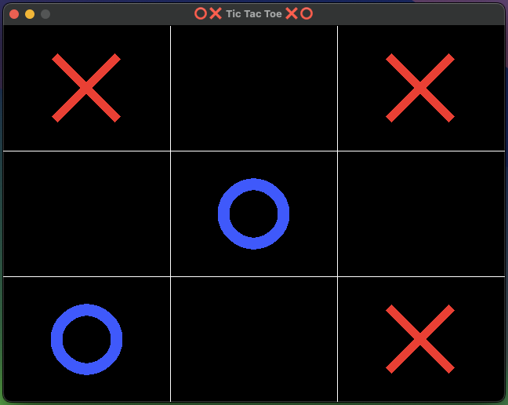

# C Tic-Tac-Toe

This application should allow users to run a tic-tac-toe game.

It was written with the purpose of learning more about how to create applications with a systems programming language and using SDL2 to collect input and render graphics.

Additionaly, the project could be used to understand how to compile the program for different targets, such as Windows, MacOS and Linux.



## Requirements

This project was developed with macOS but it can probably run on Linux as well with a few adjustments.
It requires `gcc` (it's aliased in macOS to `clang`) and `x86_64-w64-mingw32-gcc` to cross compile to Windows.

## Setup

To compile the program use: 

```bash
make
```

To run it:

```bash
./bin/main
```

To clear compiled files:

```bash
make clean
```

> [!TIP]
> If VS Code is not detecting the path to SDL add them to the path by adding `"${workspaceFolder}/include"` in the Microsoft C/C++ Extension.

# Resources

 - [[Part 1] Tic-tac-toe Game in C with SDL -- Procedural vs Functional](https://www.youtube.com/watch?v=gCVMkKgs3uQ)